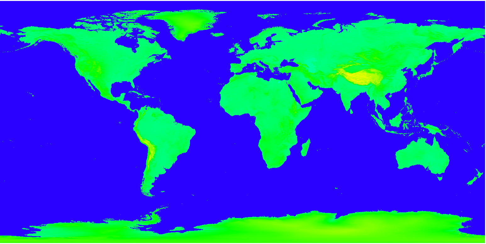
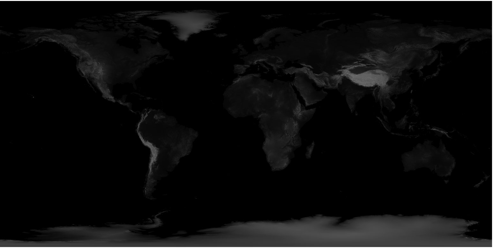

#Globe

Playing with Global Land One-kilometer Base Elevation dataset (GLOBE). Converted elevation data to a colored and white/black pngs using CUDA and OpenCV.

<<<<<<< HEAD
https://www.ngdc.noaa.gov/mgg/topo/gltiles.html  

Open png files with QGIS
=======
Download dataset from: https://www.ngdc.noaa.gov/mgg/topo/gltiles.html  

To view large images I use QGIS.  

   

   

